# FBPIC Baseline Simulation and Initial Analysis

## Purpose

This is a baseline run before the main MPhys project. The aim is to get a working FBPIC and openPMD workflow, with detailed analysis and clear, concise figures produced. This should demonstrate the key features of laser wakefield acceleration, such as a low-density electron depletion zone with a high-density sheath. It's important to note that this is only a preliminary learning and validation run, not an optimisation project.

## Computing Environment

|**Computing Element**|**Information**|
|-|-|
|System|Windows laptop|
|Linux environment|Ubuntu through WSL|
|Editor|Visual Studio Code connected to Ubuntu|
|Python environment|Conda environment: `fbpic`|
|Simulation code|FBPIC|
|Diagnostic reader|`openPMD-viewer`|
|Hardware used for this run|Intel Core Ultra 5 115U CPU; integrated Intel graphics not used for CUDA acceleration|

## Baseline Simulation

|**Quantity**|**Baseline value**|
|-|-:|
|Simulation script|[`lwfa_baseline.py`](simulation/lwfa_baseline.py)|
|Total iterations|1,800|
|Diagnostic interval|50 iterations|
|Saved outputs|36 snapshots, iterations 0-1750|
|Final analysed iteration|1750|
|Final analysed time|291.9 fs|
|Reconstructed $E_z$ grid|100 × 800 cells|

## Exact Data

|**Parameter**|**Symbol**|**Value (exactly as written in script)**|**Units**|
|-|-|-:|-|
|Plasma electron density|$n_e$|`4.e18*1.e6`|m$^{-3}$|
|Normalised laser amplitude|$a_0$|`4.`|dimensionless|
|Laser waist|$w_0$|`5.e-6`|m|
|Pulse duration|$\tau$|`16.e-15`|s|
|Laser wavelength|Inherent quantity of `GaussianLaser`|`0.8e-6`|m|
|Longitudinal resolution|$N_z$|`800`|cells|
|Radial resolution|$N_r$|`50`|cells|
|Azimuthal modes|$N_m$|`2`|N/A|
|Macroparticle sampling|$(p_{nz},p_{nr},p_{nt})$|`(2, 2, 4)`|N/A|
|Density-ramp length|`ramp_length`|`40.e-6`|m|

## Equations and theory

For an electron plasma density $n_e$, the plasma angular frequency is:

$$
\omega_p=\sqrt{\frac{n_e e^2}{m_e\epsilon_0}}.
$$

The corresponding plasma wavelength is:

$$
\lambda_p=\frac{2\pi c}{\omega_p}.
$$

The cold plasma wave-breaking field scale is:

$$
E_0=\frac{m_ec\omega_p}{e}.
$$

These are directly calculated using the density from the analysis code rather than copying the reference values. I calculated these directly as an additional sanity check.

For electron plasma density
$n_e=4.0\times10^{24}\,\mathrm{m^{-3}}$:

|Quantity|Calculated value|
|-|-:|
|Plasma angular frequency, $\omega_p$|$1.1283\times10^{14}$ rad s$^{-1}$|
|Plasma wavelength, $\lambda_p$|16.6947 μm|
|Cold wave-breaking field scale, $E_0$|192.318 GV m$^{-1}$|

$E_0$ is a reference scale, not a strict upper limit on the field, as in this simulation it is expected there will be strongly nonlinear wakes.

## Diagnostic 1: two-dimensional longitudinal field

To look for evidence of a longitudinal wake, a standard two-dimensional $E_z$ plot was mapped. This also showed where the strongest field regions were, guiding the later density and particle diagnostics.

The longitudinal electric field was loaded with `OpenPMDTimeSeries("diags/hdf5")`, which reconstructed the $\theta=0$ plane and converted the field from V m$^{-1}$ to GV m$^{-1}$ before plotting $E_z(r,z)$.

At iteration 1,750, the full reconstructed field had positive and negative extremes of:

$$
E_{z,\min}\approx-693\,\mathrm{GV\,m^{-1}},
\qquad
E_{z,\max}\approx+356\,\mathrm{GV\,m^{-1}}.
$$

The main wake can be clearly seen near the propagation axis. There is also a shorter-scale antisymmetric structure farther off-axis, which is expected to cancel during on-axis analysis. Subsequently, these oscillations were not treated as a direct measurement of the plasma wavelength.

As for electrons in the field, $F_z=-eE_z$, a negative $E_z$ corresponds to a force in the positive-$z$ direction. This assumes positive-$z$ is the forward propagation direction.

Associated files:

* [`analysis/wake/plot_ez.py`](analysis/wake/plot_ez.py)
* [`figures/wake/ez_final_full_scale.png`](figures/wake/ez_final_full_scale.png)

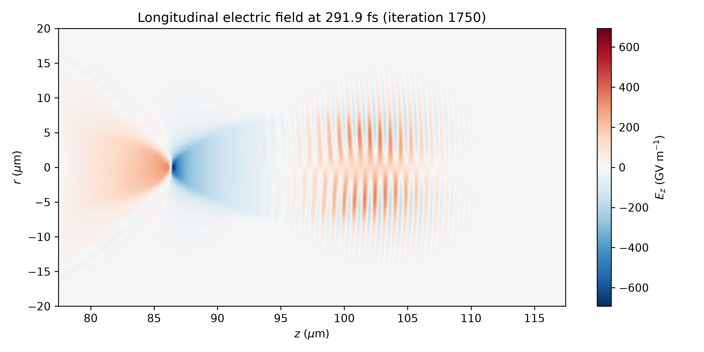

## Diagnostic 2: on-axis longitudinal field

The field was then reduced to an on-axis lineout in order to compare extrema, their positions and the longitudinal wake shape quantitatively.

The reconstructed slice contained the two cells immediately adjacent to $r=0$, with their average used to estimate the on-axis field:

$$
E_{z,\mathrm{axis}}(z)
=\frac{1}{2}[E_z(r_-,z)+E_z(r_+,z)].
$$

The resulting lineout gave:

|Measurement|Result|
|-|-:|
|Maximum on-axis field|+323.86 GV m$^{-1}$|
|Position of maximum|86.03 μm|
|Minimum on-axis field|-679.76 GV m$^{-1}$|
|Position of minimum|86.53 μm|

This showed the minimum on-axis longitudinal field to be:
$$
E_{z,\min}\approx-680\,\mathrm{GV\,m^{-1}}.
$$

This is significant when compared with the cold wave-breaking field scale, $E_0\approx192.3\,\mathrm{GV\,m^{-1}}$, as the local minimum on-axis longitudinal field is much larger than this value.

Therefore the local minimum is approximately:
$$
|E_{z,\min}|\approx3.5E_0.
$$

Importantly, the fact that the minimum on-axis field is about $3.5E_0$ does not automatically mean something is wrong, because $E_0$ is the characteristic cold-plasma scale, and this simulation deals with strongly non-linear wakes. However, this value alone doesn't prove that a strong non-linear wake was simulated. The feature will be investigated in further diagnostics, before taking $-680\,\mathrm{GV\,m^{-1}}$ as a representative wake amplitude.

Associated files:

* [`analysis/wake/plot_ez_lineout.py`](analysis/wake/plot_ez_lineout.py)
* [`figures/wake/ez_final_on_axis.png`](figures/wake/ez_final_on_axis.png)

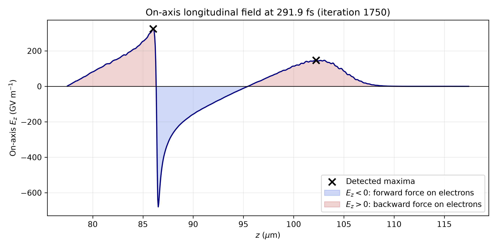

## Diagnostic 3: preliminary wake-scale measurement

This diagnostic aimed to measure the separation between strong positive $E_z$ peaks as a simple sanity check against the theoretical plasma wavelength.

Positive local maxima were detected using `scipy.signal.find_peaks`. A minimum prominence of 50 GV m$^{-1}$ was used to reject small ripples, while the minimum allowed peak separation was decided using the expected plasma wavelength and longitudinal grid spacing.

Detected positive maxima:

|Peak|Position, $z$|Field, $E_z$|
|-|-:|-:|
|1|86.025 μm|323.86 GV m$^{-1}$|
|2|102.225 μm|147.40 GV m$^{-1}$|

The measured separation was

$$
\Delta z
=102.225\,\mu\mathrm{m}-86.025\,\mu\mathrm{m}
=16.200\,\mu\mathrm{m},
$$

which is approximately 3.0% shorter than

$$
\lambda_p=16.6947\,\mu\mathrm{m}.
$$

However, despite this result looking encouraging, the later $E_x$ and laser-envelope plots placed the second maximum ($z=102.225\,\mu\mathrm{m}$) inside the main laser region, strongly suggesting that these peaks were not a clean measurement of successive wake periods. This agreement is still a useful scale check, but to perform a proper wavelength measurement, the wake would need to be isolated behind the driver, and utilise more than one interval.

Associated files:

* [`analysis/wake/measure_wake_wavelength.py`](analysis/wake/measure_wake_wavelength.py)
* [`figures/wake/measure_wake_wavelength.png`](figures/wake/measure_wake_wavelength.png)

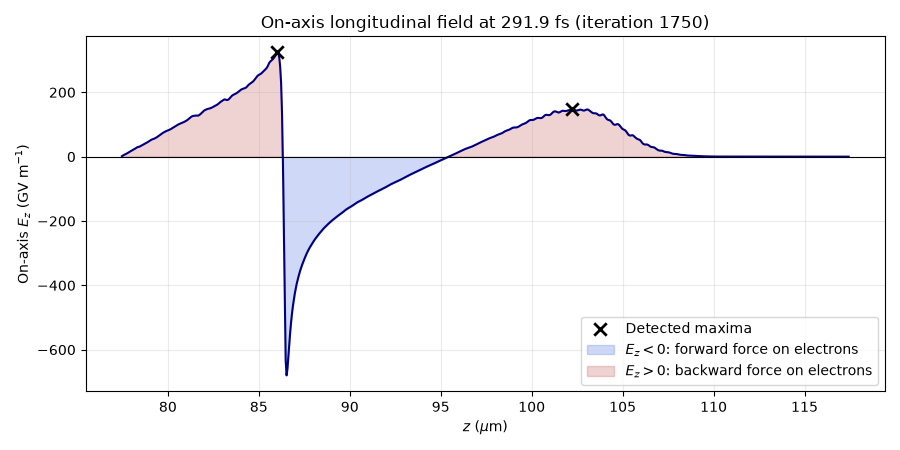

## Diagnostic 4.1: two-dimensional electron density

To further verify whether a wake was produced, the reconstructed electron density was next analysed to see what plasma structure sits around the large $E_z$ feature.
The charge density was loaded at $\theta=0$ and converted to an electron-density estimate using:

$$
n_e=-\frac{\rho}{e}.
$$

This was then normalised to the baseline density

$$
n_0=4.0\times10^{24}\,\mathrm{m^{-3}}.
$$

At iteration 1,750, the reconstructed plane gave:

|Measurement|Result|
|-|-:|
|Minimum $n_e/n_0$|-0.111|
|Maximum $n_e/n_0$|127.558|
|Median $n_e/n_0$|0.999|
|99th percentile $n_e/n_0$|2.380|

On this full scale plot, almost all of the colour range is taken up by a very narrow on-axis density compression close to

$$
z\approx86.5\,\mu\mathrm{m}.
$$

This is the same position as the large negative $E_z$ spike, which is consistent with a wake, however, not conclusive. The median remains almost exactly at the background density, so the $127.6n_0$ value is clearly a very local feature rather than something representative of the whole plane.

## Diagnostic 4.2: scaled two-dimensional electron density

To show the ordinary wake structure more clearly, a second density plot was produced with the colour scale clipped to

$$
0\leq\frac{n_e}{n_0}\leq5.
$$

The data was left completely unchanged; only the displayed colour range is different. This makes the depleted on-axis cavity and the enhanced-density sheath much easier to see. The sheath converges near $z\approx86.5\,\mu\mathrm{m}$, giving a structure that looks consistent with a strongly nonlinear, blowout-like wake. The next diagnostic places the laser in front of this feature.

### Important diagnostic note

The small negative minimum recorded cannot represent a physical electron density. It appears in the reconstructed density around a very sharp feature, but this run alone cannot establish exactly which numerical effect produced it. Finite resolution, radial particle sampling and the limited azimuthal-mode representation are possible contributors. For the same reason, I would not treat the exact $127.6n_0$ maximum as truly converged without further checks.

Associated files:

* [`analysis/wake/plot_ne.py`](analysis/wake/plot_ne.py)
* [`analysis/wake/plot_density_clipped.py`](analysis/wake/plot_density_clipped.py)
* [`figures/wake/electron_density_final_full_scale.png`](figures/wake/electron_density_final_full_scale.png)
* [`figures/wake/electron_density_final_clipped_0_5n0.png`](figures/wake/electron_density_final_clipped_0_5n0.png)

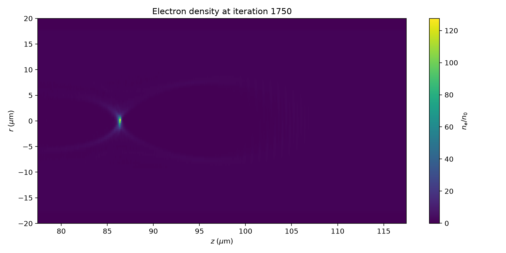

## Diagnostic 5: two-dimensional transverse laser field

The electric field in $x$-direction, $E_x$, was plotted to locate the laser relative to the wake and to check that the transverse pulse and its rapid carrier oscillations were still clearly resolved at the iteration when the final snapshot was taken.

The $x$-component of the electric field was reconstructed at $\theta=0$, converted from V m$^{-1}$ to TV m$^{-1}$ and plotted as $E_x(r,z)$. At iteration 1,750, this produced the field extrema below:

$$
E_{x,\min}\approx-12.290\,\mathrm{TV\,m^{-1}},
\qquad
E_{x,\max}\approx+12.320\,\mathrm{TV\,m^{-1}}.
$$

The plot showed the main laser pulse to be centred about $z\approx103\,\mu\mathrm{m}$. This is well ahead of the strong density and $E_z$ feature near $z\approx86.5\,\mu\mathrm{m}$. This is the expected ordering if the $z\approx86.5\,\mu\mathrm{m}$ feature belongs to a wake behind the driving laser.

The raw $E_x$ plot still contains the fast optical carrier, so I did not use a single field maximum as the laser position. I extracted the envelope later and used that to track the pulse more consistently.

Associated files:

* [`analysis/laser/plot_ex.py`](analysis/laser/plot_ex.py)
* [`figures/laser/ex_final_full_scale.png`](figures/laser/ex_final_full_scale.png)

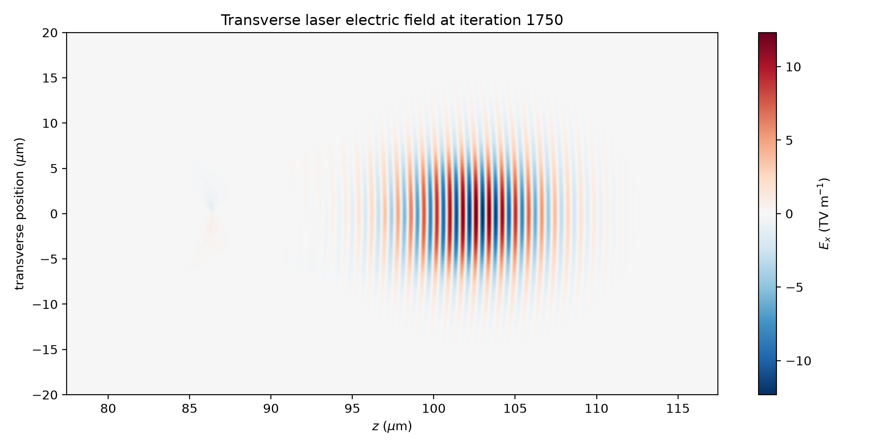

## Diagnostic 6: longitudinal electron phase space

Having identified the wake structure and the driving laser, the next question was whether a distinct high-momentum electron population had developed. I therefore plotted longitudinal position against $u_z$.

The saved electron positions and normalised longitudinal momenta were loaded using `var_list=["z", "uz"]`, where

$$
u_z=\frac{p_z}{m_ec}.
$$

At iteration 1,750, the saved-particle distribution gave:

|Measurement|Result|
|-|-:|
|Saved macroparticles|50,357|
|Longitudinal range|72.650-106.081 μm|
|Minimum $u_z$|1.000|
|Maximum $u_z$|11.905|
|Median $u_z$|1.586|
|95th percentile $u_z$|4.066|
|99th percentile $u_z$|8.189|

This produced two visibly different structures: a high-momentum branch sitting around $z\approx84$-$87\,\mu\mathrm{m}$ and reaching $u_z\approx11.9$, and a more regular lower-momentum oscillatory pattern which appeared around $z\approx101$-$106\,\mu\mathrm{m}$. This further supports previous conclusions, with the $E_x$ plot placing the laser in the second region, suggesting the oscillatory population is laser-associated, whereas the high-momentum branch is consistent with a wake.

### Diagnostic note

One limitation created by the saved particle data was the diagnostic only keeping electrons with `select={"uz": [1., None]}`. Therefore, anything below $u_z=1$ is missing from the plot, so the plot is not fully representative of the complete plasma distribution. The scatter density is also only macroparticle density, with the points not weighted by the physical number of electrons they represent.

Associated files:

* [`analysis/electrons/plot_z_uz.py`](analysis/electrons/plot_z_uz.py)
* [`figures/electrons/z_uz_phase_space_final.png`](figures/electrons/z_uz_phase_space_final.png)

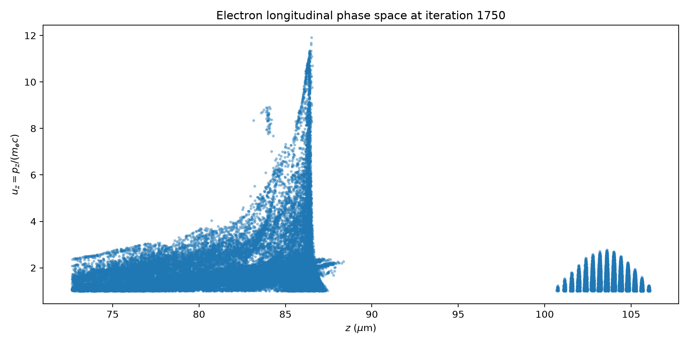

## Diagnostic 7: weighted electron energy spectrum of the saved population

Logically, the next step was to convert the saved particle momenta into kinetic energy and include the macroparticle weights so that the spectrum represented physical electron charge rather than just computational particle counts.

The Lorentz factor and kinetic energy were calculated from the three normalised momentum components:

$$
\gamma=\sqrt{1+u_x^2+u_y^2+u_z^2},
\qquad
E_k=(\gamma-1)m_ec^2.
$$

At iteration 1,750, the weighted distribution gave:

|Measurement|Result|
|-|-:|
|Saved macroparticles|50,357|
|Minimum kinetic energy|0.214 MeV|
|Maximum kinetic energy|5.611 MeV|
|Weighted mean energy|1.122 MeV|
|Weighted RMS spread|0.965 MeV|
|Charge of saved $u_z\geq1$ population|346.916 pC|

The spectrum produced was broad and mostly weighted towards lower energies, with a tail reaching to about $5.6\,\mathrm{MeV}$. Importantly, this cannot be called a true "beam spectrum", as the $u_z\geq1$ diagnostic mixes several different forward-moving populations together.

Macroparticle weights were included through

$$
Q=e\sum_i w_i,
$$

which gave
$$
Q_{\mathrm{saved}}=346.916\,\mathrm{pC}.
$$
The charge $Q_{\mathrm{saved}}$ represents the charge of every saved electron above the diagnostic cutoff, whether or not that electron belongs to the late wake-associated population.

Associated files:

* [`analysis/electrons/plot_energy_spectrum.py`](analysis/electrons/plot_energy_spectrum.py)
* [`figures/electrons/electron_energy_spectrum_final.png`](figures/electrons/electron_energy_spectrum_final.png)

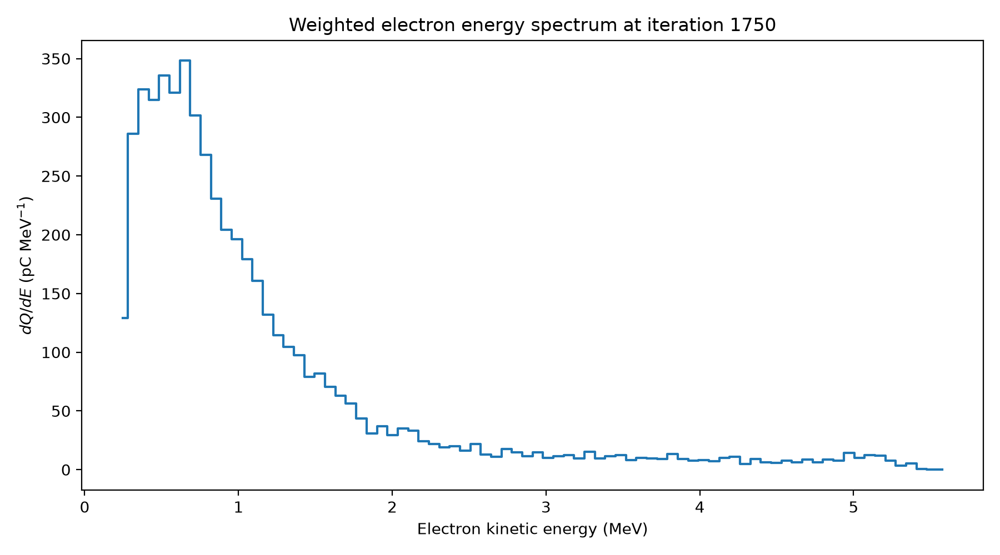

## Diagnostic 8: maximum saved-electron energy versus time

The next key diagnostic was to calculate the maximum energy over all 36 saved snapshots to see both when high-energy particles first appeared, and whether the final $5.611\,\mathrm{MeV}$ value developed smoothly.

The methodology was to repeat the kinetic energy calculation from Diagnostic 7 for all 36 saved iterations. This didn't produce any particles satisfying the $u_z\geq1$ diagnostic selection for the first five saved outputs, with the first saved $u_z\geq1$ particles appearing at approximately $41.7\,\mathrm{fs}$.

When kinetic energy was calculated for each iteration, the maximum saved-electron energy then showed a strongly non-monotonic evolution:

|Time|Maximum kinetic energy|
|-|-:|
|41.70 fs|1.139 MeV|
|83.39 fs|4.671 MeV|
|150.10 fs|2.380 MeV|
|200.14 fs|1.913 MeV|
|250.17 fs|4.287 MeV|
|291.87 fs|5.611 MeV|

The above graph demonstrates the maximum rising quickly, then falling throughout the middle of the run and then rising again after about $200\,\mathrm{fs}$. This does not mean one electron accelerated, lost energy and then accelerated again. Any macroparticle can be the maximum at each snapshot point.

The later phase-space and laser-envelope plots make this much clearer, with the early high-energy feature overlapping with the laser region, while the final high-momentum population is clearly behind the driving laser. This is a good example of why $E_{\max}$ on its own is a poor optimisation metric.

Associated files:

* [`analysis/electrons/plot_max_energy_vs_time.py`](analysis/electrons/plot_max_energy_vs_time.py)
* [`figures/electrons/max_electron_energy_vs_time.png`](figures/electrons/max_electron_energy_vs_time.png)

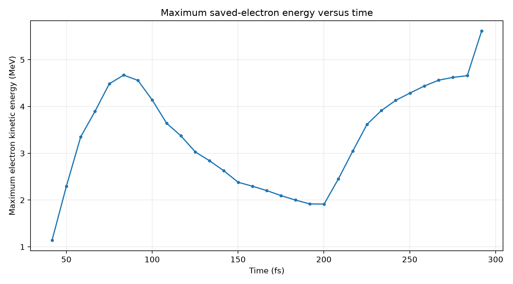

## Diagnostic 9: longitudinal-field extrema versus time

Following the unexpected maximum energy result, $E_{\max}$ was compared with the on-axis $E_z$ extrema over the same saved iterations. This tested whether the changes in maximum particle energy followed the changes in the strongest longitudinal field.

The on-axis $E_z$ lineout was reconstructed at every saved iteration with the positive and negative extrema recorded. The longitudinal wake grew strongly through the simulation, reaching the final values found in the earlier diagnostic which only examined iteration 1750 of:

$$
E_{z,\min}\approx-680\,\mathrm{GV\,m^{-1}},
\qquad
E_{z,\max}\approx+324\,\mathrm{GV\,m^{-1}}.
$$

Interestingly, between $80$ and $200\,\mathrm{fs}$, the negative $E_z$ extremum becomes much stronger while the maximum saved-electron energy falls. This shows why the largest field at one position cannot by itself predict the largest particle energy. An electron's energy depends on the fields encountered along its path, and the electron giving the maximum can change between snapshots. The timing does not identify how the early particles gained energy, but the phase-space and laser-position diagnostics place that early high-energy structure with the laser rather than with the late wake-associated branch. Spatial overlap does not establish a specific acceleration mechanism.

After about $200\,\mathrm{fs}$, the on-axis $E_z$ extremum keeps growing and a separate high-momentum population develops behind the laser. The maximum energy rises again at the same time. The phase-space location strengthens the late wake-associated interpretation; the two rising curves alone would not establish that the field extremum accelerated those particular electrons.

Associated files:

* [`analysis/wake/plot_ez_extrema_vs_time.py`](analysis/wake/plot_ez_extrema_vs_time.py)
* [`figures/wake/ez_extrema_vs_time.png`](figures/wake/ez_extrema_vs_time.png)

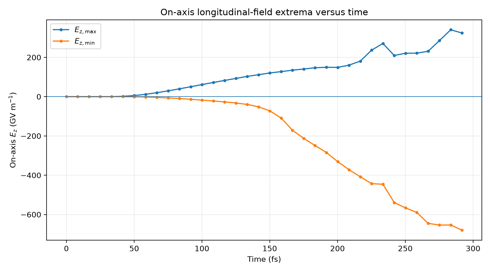

## Diagnostic 10: longitudinal phase-space evolution

As a further test, the phase space was plotted at five times to see where the high-momentum structures appeared as the run progressed.

The $z$-$u_z$ distribution was compared at five representative saved iterations:

|Iteration|Time|Saved macroparticles|Maximum $u_z$|
|-|-:|-:|-:|
|500|83.39 fs|28,172|9.053|
|900|150.10 fs|35,352|4.032|
|1200|200.14 fs|38,775|4.272|
|1500|250.17 fs|46,384|8.506|
|1750|291.87 fs|50,357|11.905|

At $83.4\,\mathrm{fs}$ the largest $u_z$ value is part of a regular sequence of peaks near the front of the saved distribution. The high-momentum feature mostly disappears by $150$-$200\,\mathrm{fs}$, but by $250\,\mathrm{fs}$, a different branch has appeared well behind the regular forward oscillations, and this later branch becomes much stronger by the final snapshot.

This is key: the phase-space structure changes, so the rise-fall-rise in $E_{\max}$ should not be interpreted as the energy history of one bunch. The snapshots do not identify individual electrons. The next diagnostic tests whether the regular forward pattern moves with the laser.

Associated files:

* [`analysis/electrons/plot_z_uz_evolution.py`](analysis/electrons/plot_z_uz_evolution.py)
* [`figures/electrons/z_uz_phase_space_evolution.png`](figures/electrons/z_uz_phase_space_evolution.png)

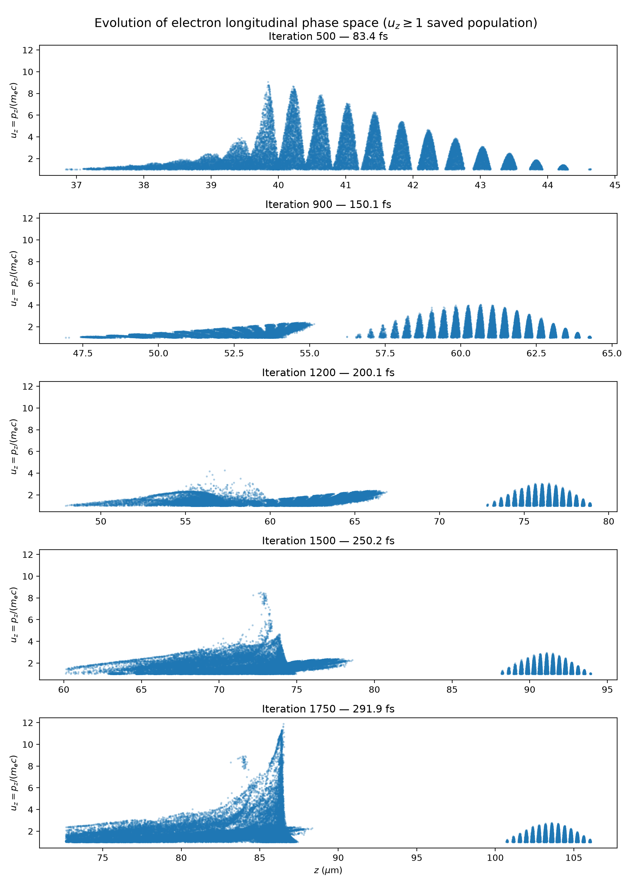

## Diagnostic 11.1: laser position and envelope evolution

To test whether the regular forward phase-space pattern is tied to the laser, I tracked the laser envelope at the same times shown in the phase-space plots.

For each selected iteration, the two cells nearest the axis were averaged to obtain an on-axis $E_x(z)$ lineout. The rapidly oscillating carrier was converted to an envelope estimate using the magnitude of the analytic signal from a Hilbert transform. The position of the largest envelope value was used as the laser-envelope peak position.

|Iteration|Time|Laser-envelope peak $z$|Peak envelope|
|-|-:|-:|-:|
|500|83.39 fs|39.931 μm|15.509 TV m$^{-1}$|
|900|150.10 fs|59.831 μm|14.559 TV m$^{-1}$|
|1200|200.14 fs|75.081 μm|13.490 TV m$^{-1}$|
|1500|250.17 fs|90.332 μm|12.850 TV m$^{-1}$|
|1750|291.87 fs|102.832 μm|12.512 TV m$^{-1}$|

This shows a clear result: the laser-envelope peak moves with the regular peak-dip-peak pattern in the $z$-$u_z$ plots. This is strong evidence to treat that forward oscillatory structure as laser-associated rather than part of the late wake bunch.

The peak envelope also falls from about $15.5$ to $12.5\,\mathrm{TV\,m^{-1}}$, around a 19% reduction. That shows the pulse is changing, however, this is not necessarily a 19% laser-energy loss. This is because a change in pulse width, focusing or shape can also change the peak field, so the evidence is insufficient.

At the final snapshot the laser-envelope maximum is at

$$
z_{\mathrm{laser}}=102.832\,\mu\mathrm{m},
$$

whereas the strong high-momentum trailing branch is around

$$
z\approx86.5\,\mu\mathrm{m}.
$$

This is a separation of approximately $16.3\,\mu\mathrm{m}$, close to the reference $\lambda_p=16.6947\,\mu\mathrm{m}$. This puts the late high-momentum population at roughly the expected wake scale behind the driving laser. This is a geometrical consistency check, not a precision measurement of the nonlinear wake period.

Associated files:

* [`analysis/laser/plot_laser_position_evolution.py`](analysis/laser/plot_laser_position_evolution.py)
* [`figures/laser/laser_position_evolution.png`](figures/laser/laser_position_evolution.png)

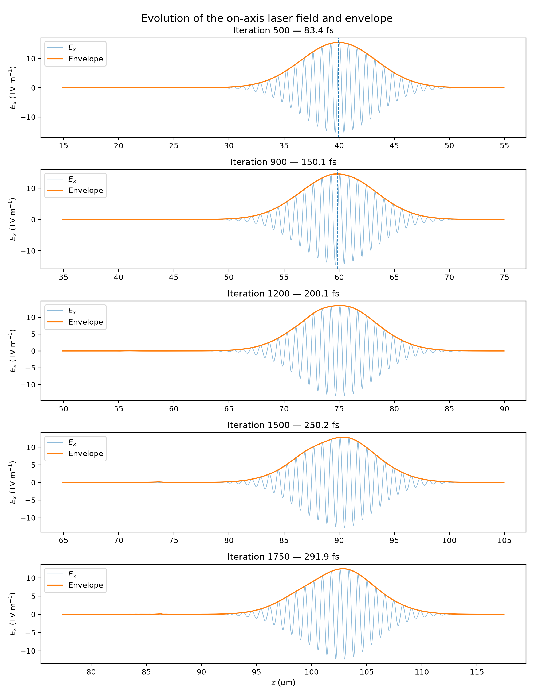

## Diagnostic 11.2: laser spot-size and peak-$a_0$ evolution

Diagnostic 11.1 showed that the peak transverse laser field fell throughout the simulation. However, the on-axis field alone could not show whether this resulted from transverse expansion, pump depletion or a change in the pulse shape. I therefore extended the analysis to measure the laser spot size and peak normalised vector potential at every saved iteration.

### Method

The reconstructed $E_x(x,z)$ field contains both the rapidly oscillating laser and slower plasma-field structure. A longitudinal Fourier transform was therefore used to retain wavenumbers around the laser carrier:

$$
0.5k_0\leq k\leq1.5k_0,
\qquad
k_0=\frac{2\pi}{\lambda_0}.
$$

After transforming back into real space, the magnitude of the analytic signal was calculated along $z$ using a Hilbert transform. This produced an estimate of the laser-field envelope:

$$
\mathcal{E}(x,z)
=
\left|
E_{x,\mathrm{laser}}(x,z)
+i\mathcal{H}\!\left[E_{x,\mathrm{laser}}(x,z)\right]
\right|.
$$

The squared envelope was integrated across the longitudinal pulse window to produce a transverse weighting:

$$
F(x)=\int_{\mathrm{pulse}}\mathcal{E}^2(x,z)\,dz.
$$

The transverse centroid and variance were then calculated from

$$
\bar{x}
=
\frac{\int xF(x)\,dx}
{\int F(x)\,dx},
$$

and

$$
\sigma_x^2
=
\frac{\int(x-\bar{x})^2F(x)\,dx}
{\int F(x)\,dx}.
$$

For a Gaussian intensity profile of the form

$$
I(x)\propto
\exp\left(-\frac{2x^2}{w^2}\right),
$$

the spot size is related to the transverse variance by

$$
w=2\sigma_x.
$$

The two cells nearest the propagation axis were averaged before taking the peak envelope value. This was converted into the normalised vector potential using

$$
a_0
=
\frac{eE_{\mathrm{env}}}
{m_ec\omega_0},
\qquad
\omega_0=\frac{2\pi c}{\lambda_0}.
$$

### Vacuum and matched-waist comparisons

For comparison, the vacuum evolution of an initially focused Gaussian beam was calculated from

$$
w_{\mathrm{vac}}(z)
=
w_0
\sqrt{
1+
\left(
\frac{\Delta z}{z_R}
\right)^2
},
$$

where

$$
z_R=\frac{\pi w_0^2}{\lambda_0}.
$$

For $w_0=5,\mu\mathrm{m}$ and $\lambda_0=0.8,\mu\mathrm{m}$, this gives

$$
z_R\approx98.2\,\mu\mathrm{m}.
$$

The approximate blowout matching condition was also included:

$$
k_pw_m\approx2\sqrt{a_0}.
$$

Using the plateau density and input $a_0=4$ gives

$$
w_m\approx10.6\,\mu\mathrm{m}.
$$

This line is an approximate full-density equilibrium scale rather than a prediction that the pulse should immediately expand to $10.6,\mu\mathrm{m}$. The matching condition also changes through the density ramp because $k_p$ depends on the local plasma density.

### Results

| Measurement    | Initial value | Final value | Change |
| -------------- | ------------: | ----------: | -----: |
| Spot size, $w$ |      5.052 μm |    6.542 μm | +29.5% |
| Peak $a_0$     |         3.988 |       3.118 | -21.8% |
| Product $a_0w$ |      20.15 μm |    20.40 μm |  +1.2% |

The initial values are close to the simulation inputs of

$$
w_0=5\,\mu\mathrm{m},
\qquad
a_0=4,
$$

which provides a useful check that the diagnostic is recovering the expected laser scale.

The measured spot expands smoothly throughout the run. At the final output, vacuum diffraction predicts

$$
w_{\mathrm{vac}}\approx6.710\,\mu\mathrm{m},
$$

compared with the measured value

$$
w_{\mathrm{measured}}\approx6.542\,\mu\mathrm{m}.
$$

The measured spot is therefore only about 2.5% smaller than the vacuum prediction. This is consistent with propagation remaining largely diffraction-like over the simulated distance. The difference might reflect some plasma focusing, but without a vacuum control run or an uncertainty estimate for the measured spot size, it cannot establish that focusing occurred.

The pulse reached the beginning of the plasma at approximately $50.1,\mathrm{fs}$ and the full-density plateau at approximately $183.9,\mathrm{fs}$. It travelled through only $32.8,\mu\mathrm{m}$ of plateau plasma before the final saved output. This is approximately one-third of the vacuum Rayleigh length, so the absence of a complete spot-size oscillation is not surprising.

The decrease in peak $a_0$ occurs at the same time as the transverse expansion. In particular, the product $a_0w$ changes by only about 1.2%. For a pulse that remains approximately Gaussian without a large change in duration, this is the behaviour expected when the on-axis field falls mainly because the pulse spreads transversely.

This resolves part of the ambiguity identified in Diagnostic 11. The decrease in the laser-envelope peak does not require a comparable loss of total laser energy and is largely explained by the increasing spot size. However, this analysis does not directly measure total pulse energy, so it cannot rule out some pump depletion or longitudinal pulse reshaping.

The result also provides context for the wake and particle diagnostics. The density cavity, large longitudinal field and late high-momentum population formed while the laser was expanding and its peak $a_0$ was falling, rather than behind a demonstrably stable matched driver. The candidate-bunch results should therefore be understood as properties of this short, transient baseline rather than an optimised accelerator configuration.

Associated files:

* [`analysis/laser/analyse_laser_propagation.py`](analysis/laser/analyse_laser_propagation.py)
* [`results/laser_propagation.csv`](results/laser_propagation.csv)
* [`figures/laser/laser_propagation_evolution.png`](figures/laser/laser_propagation_evolution.png)

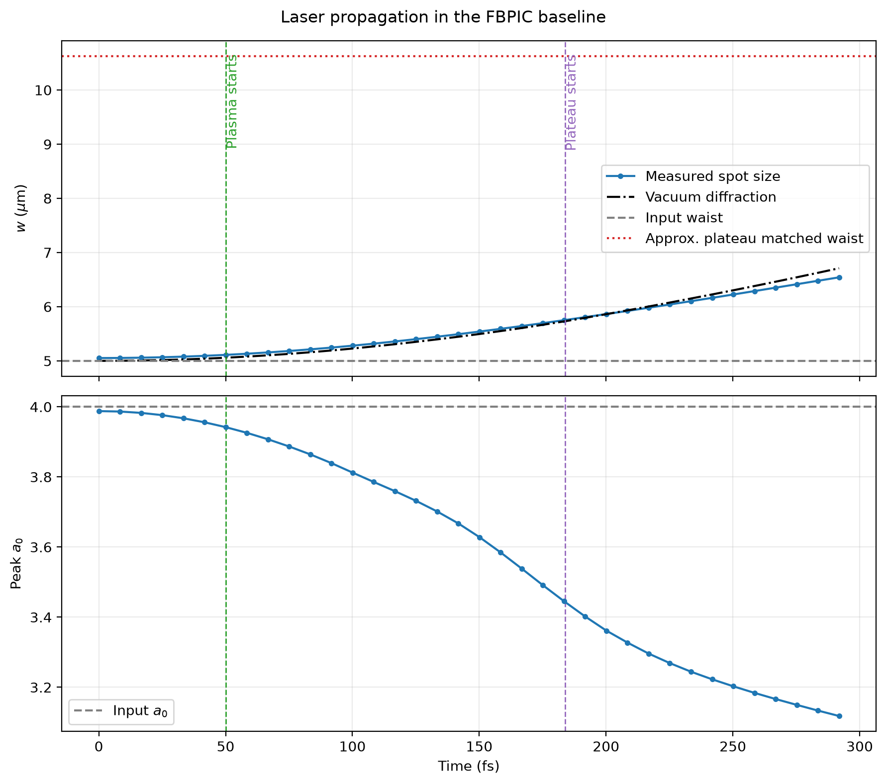

## Diagnostic 12: robustness of the large $E_z$ spike

Before calculating candidate-bunch properties, I returned to the sharp $E_z$ feature identified in the earlier field and density diagnostics. The raw on-axis lineout was compared with three-cell and five-cell moving averages around the $-680\,\mathrm{GV\,m^{-1}}$ minimum. A first-percentile value was also calculated within the selected wake region to provide a measure that is not controlled by the single most extreme cell. This checks whether the feature persists under modest averaging.

While the exact minimum becomes less negative after spatial averaging, the feature remains of order several hundred GV m$^{-1}$ and the three- and five-cell averaged curves continue to reach below approximately $-600\,\mathrm{GV\,m^{-1}}$. The first percentile of the wake-region field is also strongly negative, at roughly $-580\,\mathrm{GV\,m^{-1}}$.

The feature survives both averages, so the strong negative field is not confined to one cell. The raw $-680\,\mathrm{GV\,m^{-1}}$ value is still a very local extreme, though, and should be treated as a peak rather than as the typical wake amplitude. Averaging several cells does not establish numerical convergence or exclude an artefact extending across several cells. That requires a separate comparison with different resolutions and particle sampling.

Associated files:

* [`analysis/validation/test_ez_spike_robustness.py`](analysis/validation/test_ez_spike_robustness.py)
* [`figures/validation/ez_spike_robustness.png`](figures/validation/ez_spike_robustness.png)

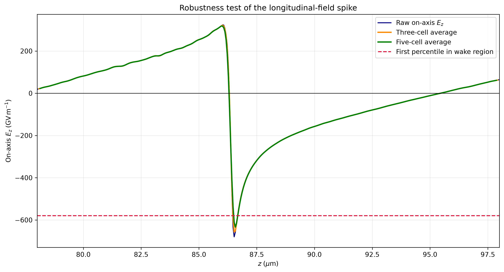

## Diagnostic 13.1: candidate wake-bunch selection and beam metrics

With the laser and trailing high-momentum branch identified, I separated that branch from the full saved $u_z\geq1$ population. This allowed candidate-bunch quantities to be calculated without treating every forward-moving electron as part of the same bunch.

A laser-relative coordinate was defined as

$$
\xi=z-z_{\mathrm{laser}},
$$

where $\xi=0$ corresponds to the final laser-envelope peak at $z_{\mathrm{laser}}=102.832\,\mu\mathrm{m}$. Negative $\xi$ is therefore behind the laser.

Electron-bunch charge is represented as a positive charge magnitude and the candidate electron bunch was selected using

$$
-20\leq\xi\leq-14\,\mu\mathrm{m},
$$

and

$$
u_z\geq4.
$$

The spatial window was chosen to cover the late branch behind the laser, while $u_z\geq4$ cuts away most of the large low-momentum population underneath it. As these are analysis choices and not unique physical boundaries, a check was performed to see how much the result moved when the cuts were changed.

For the nominal selection:

|Measurement|Result|
|-|-:|
|Saved macroparticles in full $u_z\geq1$ diagnostic|50,357|
|Candidate-bunch macroparticles|2,609|
|$Q_{\mathrm{saved}}$|346.916 pC|
|$Q_{\mathrm{bunch}}$|43.254 pC|
|Fraction of saved charge|12.47%|
|Weighted mean bunch energy|3.235 MeV|
|Histogram peak energy|2.542 MeV|
|Maximum bunch energy|5.611 MeV|
|Weighted RMS energy spread|1.072 MeV|
|Relative RMS energy spread|33.14%|

The selected population is clearly broad rather than quasi-monoenergetic. The $5.611\,\mathrm{MeV}$ value is only the end of the high-energy tail, so I would not describe this as a 5.6 MeV beam. The weighted mean, $3.235\,\mathrm{MeV}$, is a better description of the selected population, and the 33% relative RMS spread shows how broad it still is.

The low-energy edge of the selected spectrum is partly imposed by the $u_z\geq4$ momentum cut itself. The spectrum should therefore be interpreted together with the phase-space selection rather than as an independent natural low-energy boundary.

Associated files:

* [`analysis/electrons/analyse_final_bunch.py`](analysis/electrons/analyse_final_bunch.py)
* [`figures/electrons/final_bunch_selection.png`](figures/electrons/final_bunch_selection.png)
* [`figures/electrons/final_bunch_energy_spectrum.png`](figures/electrons/final_bunch_energy_spectrum.png)

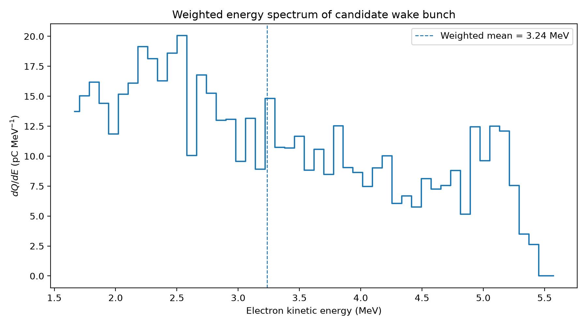

## Diagnostic 13.2: candidate-bunch selection sensitivity

The spatial and momentum limits were varied to test whether the candidate-bunch conclusion depended on a narrow choice of selection boundaries.

### Spatial-window sensitivity

With $u_z\geq4$ fixed:

|$\xi$ range|$Q$ (pC)|Weighted mean energy (MeV)|Relative RMS spread|Macroparticles|
|-|-:|-:|-:|-:|
|-21 to -14 μm|43.599|3.228|33.18%|2,626|
|-20 to -14 μm|43.254|3.235|33.14%|2,609|
|-19 to -14 μm|40.710|3.279|33.24%|2,510|
|-20 to -13 μm|43.254|3.235|33.14%|2,609|
|-20 to -15 μm|43.254|3.235|33.14%|2,609|

The spatial cut is not especially sensitive. Moving the boundaries by about $1\,\mu\mathrm{m}$ only changes the charge by a few pC, while the mean energy and relative spread hardly move. Shifting the right-hand edge does nothing at all in several cases, which shows that the selected high-$u_z$ branch already ends before that boundary.

### Momentum-cut sensitivity

With $-20\leq\xi\leq-14\,\mu\mathrm{m}$ fixed:

|Minimum $u_z$|$Q$ (pC)|Weighted mean energy (MeV)|Relative RMS spread|Macroparticles|
|-|-:|-:|-:|-:|
|3.5|50.433|3.009|37.94%|3,376|
|4.0|43.254|3.235|33.14%|2,609|
|4.5|37.208|3.449|28.99%|2,048|
|5.0|31.316|3.676|25.08%|1,594|

The momentum cut matters more, which makes sense because it passes through the lower edge of the branch itself. Increasing the threshold removes more of the lower-energy population, so the selected charge falls while the mean energy rises and the relative spread gets smaller.

At the final snapshot, all the tested momentum cuts give the same general picture: tens of pC, a few MeV and a broad spectrum. This does not mean that the charge is equally insensitive to the cut earlier in the run. A momentum cut-off of $u_z\geq4$ was kept as the nominal choice because it follows the visible separation in phase space and is close to the 95th percentile of the full saved population. The exact bunch numbers should still be read as selection-dependent.

Associated file:

* [`analysis/validation/test_bunch_selection_sensitivity.py`](analysis/validation/test_bunch_selection_sensitivity.py)

## Diagnostic 13.3: evolution of the candidate population

The final-snapshot selection was then applied to every saved iteration to see how the candidate population developed during the run. At each iteration, the measured laser position was used to define

$$
\xi = z - z_{\mathrm{laser}},
$$

with saved electrons satisfying $-20\leq\xi\leq-14\,\mu\mathrm{m}$ and $u_z\geq4$ selected as candidates. The charge was calculated from the macroparticle weights, while the mean kinetic energy and relative RMS spread were also weighted. Iterations with no selected particles have zero charge; their mean energy and spread are undefined and are not plotted.

The selected charge stayed very small for most of the run, then grew rapidly towards the final snapshot. Three iterations show the main change:

| Iteration | Selected macroparticles | Selected charge (pC) | Weighted mean energy (MeV) | Relative RMS spread |
| --------: | ----------------------: | -------------------: | -------------------------: | ------------------: |
|      1450 |                     144 |               0.00223 |                      2.416 |               29.7% |
|      1500 |                     243 |                2.628 |                      1.907 |                5.0% |
|      1750 |                   2,609 |               43.254 |                      3.235 |               33.1% |

The increase between iterations 1450 and 1500 requires additional analysis. The number of selected macroparticles rises from 144 to 243, but the charge rises much more sharply because the selected set at iteration 1500 contains particles with much greater macroparticle weights. Raising the momentum threshold shows where the charge at iteration 1500 lies:

| Iteration | Charge for $u_z\geq4$ (pC) | Charge for $u_z\geq4.5$ (pC) | Charge for $u_z\geq5$ (pC) |
| --------: | -------------------------: | ---------------------------: | -------------------------: |
|      1450 |                    0.00223 |                      0.00142 |                    0.00106 |
|      1500 |                      2.628 |                        0.231 |                    0.00112 |
|      1750 |                     43.254 |                       37.208 |                     31.316 |

At iteration 1500, approximately $2.397\,\mathrm{pC}$, or 91% of the nominal selected charge, lies in $4\leq u_z<4.5$. The charge above $u_z=5$ is almost unchanged from iteration 1450. The lower mean energy and spread at iteration 1500 therefore reflect the change in which particles dominate the weighted selection; they do not show that the electrons selected at iteration 1450 decelerated. By iteration 1750, the higher-momentum part of the branch is much more substantial: $31.316\,\mathrm{pC}$ remains when the threshold is raised to $u_z\geq5$.

The charge evolution under all three momentum cuts adds to this comparison. Appreciable weighted charge first appears under the nominal selection around iteration 1500, initially concentrated close to $u_z=4$. The charge above $u_z=5$ remains very small at that snapshot, then grows rapidly in the following saved outputs. Alongside the phase-space location behind the laser, this provides stronger evidence that a candidate accelerated population develops in the wake during the run. It locates the change in the selected distribution, not the injection time of individual electrons. The three-cut plot uses a logarithmic charge axis and shows only snapshots with nonzero selected charge; the earlier zero-charge snapshots remain visible in the full bunch-evolution plot.

Selected charge was also analysed alongside the measured laser spot size and peak $a_0$ on a common propagation-distance axis. The laser expands and its peak $a_0$ falls while the selected charge grows late in the run. This establishes when the changes occur relative to one another, but does not show that the change in laser spot size caused the charge increase.

The selection is repeated independently at each snapshot, so these measurements are not trajectories of the same electrons. Particle IDs were not saved, and the particle diagnostic excluded electrons with $u_z<1$. The figures also show longitudinal position and momentum without checking the radial distribution of the selected charge. At the final snapshot, the visible high-momentum branch extends across the sharp on-axis $E_z$ sign change near $z\approx86\,\mu\mathrm{m}$; the unweighted scatter plot cannot show how much selected charge lies on either side, and the on-axis field need not equal the field at each particle. The results are consistent with late capture and acceleration in the wake, but cannot establish precisely when individual electrons were injected, whether all selected electrons are currently in an accelerating phase, how long they remained trapped, or what caused the charge to increase.

Associated files:

* [`analysis/electrons/analyse_bunch_evolution.py`](analysis/electrons/analyse_bunch_evolution.py)
* [`analysis/validation/test_bunch_cut_sensitivity.py`](analysis/validation/test_bunch_cut_sensitivity.py)
* [`figures/electrons/bunch_evolution.png`](figures/electrons/bunch_evolution.png)
* [`figures/electrons/laser_bunch_comparison.png`](figures/electrons/laser_bunch_comparison.png)
* [`figures/electrons/charge_evolution_cutoff_comparison.png`](figures/electrons/charge_evolution_cutoff_comparison.png)
* [`figures/validation/check_momentum_histogram/candidate_momentum_histogram_1500.png`](figures/validation/check_momentum_histogram/candidate_momentum_histogram_1500.png)

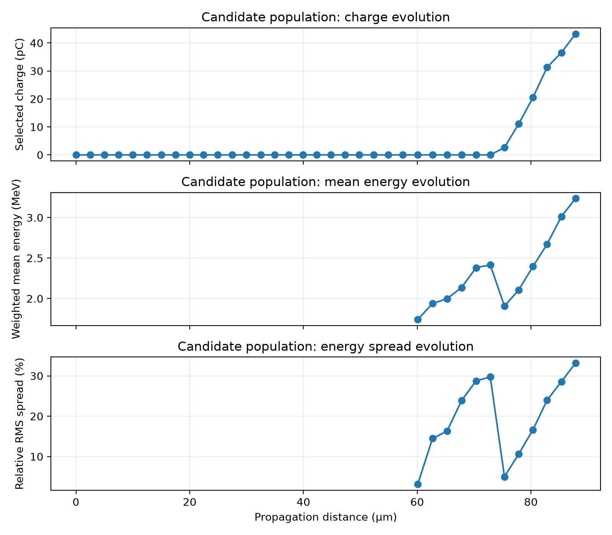

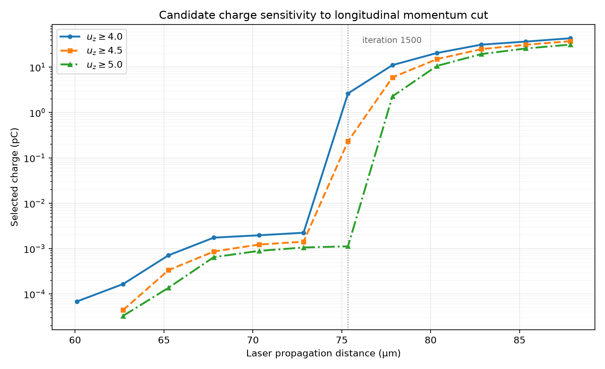

## Overall interpretation

The diagnostics now present a clear picture of this first run. At the final snapshot, the laser sits near $z\approx103\,\mu\mathrm{m}$, with the clipped density plot clearly showing a depleted cavity and a dense sheath which closes near $z\approx86.5\,\mu\mathrm{m}$. As this is almost exactly where the strongest negative on-axis $E_z$ appears, these features together provide strong evidence that a wake formed.

The final phase-space plot also puts the high-momentum branch in this trailing region, and separates it from the regular oscillatory structure that moves with the laser. These are distinct phase-space structures, although the saved snapshots cannot establish the histories of individual electrons.

The candidate selection remained at very low charge until late in the run. Appreciable selected charge first appears around iteration 1500 under the nominal $u_z\geq4$ cut, although this initial rise is concentrated in $4\leq u_z<4.5$ and depends strongly on the threshold. Charge then grows under the stricter cuts too; by the final snapshot, $31.316\,\mathrm{pC}$ remains even with $u_z\geq5$. Together with the trailing phase-space branch and the wake structure, this supports the emergence and growth of a candidate accelerated population in the wake. It is consistent with late capture and acceleration, but these independently selected snapshots do not identify an injection time or demonstrate continuous trapping for individual electrons. The radial distribution and the selected charge's position relative to the accelerating field remain to be checked.

One of the main lessons from the baseline is that neither peak $E_z$ nor $E_{\max}$ tells the whole story. The wake can strengthen while the maximum saved-particle energy falls, and the full saved spectrum mixes laser-associated and wake-associated electrons. Bunch metrics only become useful after the relevant population has been identified in phase space.

For the nominal late-time bunch selection, the result is approximately

$$
Q_{\mathrm{bunch}}\approx43\,\mathrm{pC},
$$

$$
\bar E_{\mathrm{bunch}}\approx3.24\,\mathrm{MeV},
$$

with a relative RMS energy spread of approximately

$$
\frac{\sigma_E}{\bar E}\approx33%.
$$

The exact numbers move with the lower momentum cut, but not enough to change the main conclusion: the late wake-associated population is at the tens-of-pC level, has a characteristic energy of a few MeV and is broad-spectrum rather than cleanly quasi-monoenergetic.

## Limitations and next checks

* The initial $16.2\,\mu\mathrm{m}$ peak-separation result is not an unambiguous wake-wavelength measurement because the second detected $E_z$ maximum lies within the laser region.
* The laser-propagation diagnostic also explains the reduction in the transverse-field envelope identified earlier. The spot size increased by about 29.5% while the peak $a_0$ fell by about 21.8%, with $a_0w$ remaining approximately constant. This is mainly consistent with diffraction-driven transverse expansion rather than direct evidence of pump depletion. The propagation remained close to the vacuum prediction, although the short distance travelled through the full-density plateau prevents a strong conclusion about longer-term self-focusing or matched guiding.
* The exact $127.6n_0$ density spike and $-680\,\mathrm{GV\,m^{-1}}$ field minimum are highly localised. Their associated large-scale structures are physically coherent and the $E_z$ spike survives modest spatial averaging, but their exact amplitudes are not yet numerically converged.
* The $z$-$u_z$ scatter plots are unweighted visualisations. Macroparticle weights are included in charge and energy distributions but not in the displayed scatter-point density.
* The particle diagnostic excludes electrons with $u_z<1$, so none of the saved-particle plots represent the complete plasma-electron population.
* The candidate bunch is defined using explicit spatial and momentum cuts. The spatial selection is relatively insensitive to small changes, while the inferred charge, mean energy and spread vary more noticeably with the lower momentum threshold. The selected charge has not yet been checked against radial position or against the local accelerating-field phase.
* The laser-propagation diagnostic measures spot size and peak $a_0$ from the transverse fluence and field envelope. It does not directly measure total pulse energy or pump depletion.
* Numerical convergence with respect to longitudinal/radial resolution, macroparticle sampling and retained azimuthal modes has not yet been tested for either the sharp field and density peaks or the selected bunch charge.
* Before parameter optimisation, at least a small numerical-validation comparison should be performed so that optimisation metrics are not dominated by resolution, sampling or mode choices.
* Individual particle IDs were not tracked between saved snapshots, so the phase-space evolution distinguishes changing populations by their structure and position but does not provide individual electron trajectories.
