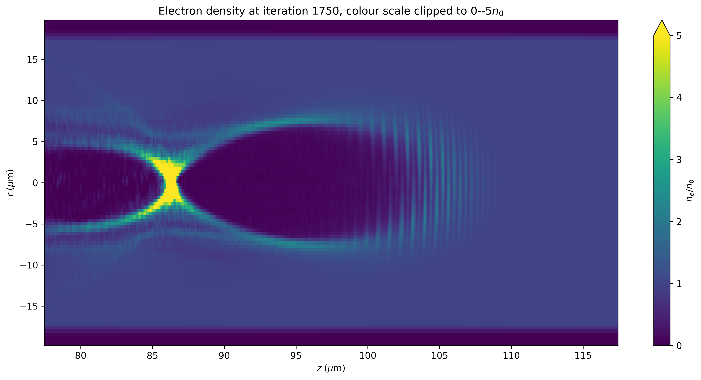
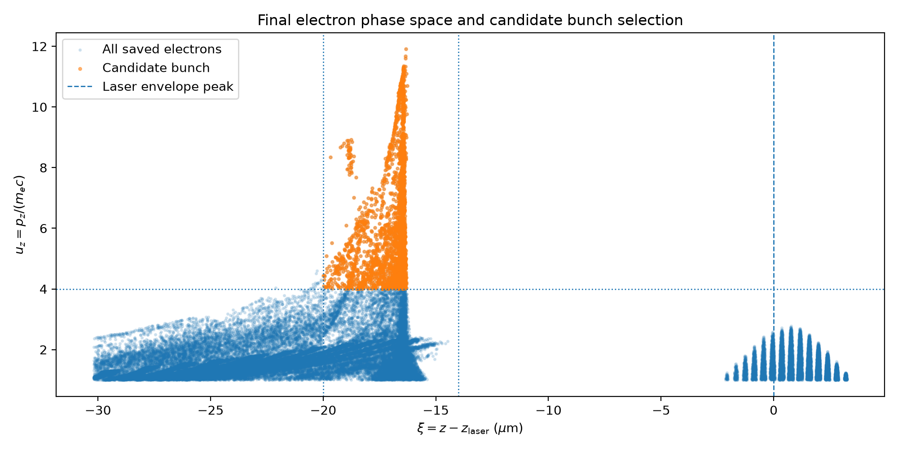

# FBPIC LWFA Baseline: Diagnostic Analysis

This repository records a small CPU-based laser-wakefield-acceleration
baseline completed before my MPhys project, *Optimising Laser Wakefield
Acceleration*. The aim was to establish a working FBPIC/openPMD workflow and
produce diagnostic figures from which defensible physical conclusions could
be extracted.

The simulation input is a lightly adapted CPU version of FBPIC's standard
LWFA example. My independent work was the diagnostic workflow. This involved
analysing the field, density and phase-space data contained in the simulation
outputs; tracking the laser and particle populations through time;
calculating weighted candidate-bunch quantities; and testing how sensitive
the main conclusions were to local field extrema and analysis cuts.

This is a learning and validation baseline. It is not an optimised or
numerically converged accelerator result.

## Main results

| Quantity | Baseline result | Interpretation |
| --- | ---: | --- |
| Reference plasma wavelength | 16.6947 micrometres | Calculated from the input density |
| Final laser-envelope peak | 102.832 micrometres | Obtained from the on-axis transverse-field envelope |
| Late high-momentum branch | approximately 84-87 micrometres | Located about one reference plasma wavelength behind the laser |
| Raw minimum on-axis longitudinal field | -679.76 GV/m | A highly local peak, not a representative average wake amplitude |
| Smoothed longitudinal-field minimum | below approximately -600 GV/m | The feature survives three- and five-cell longitudinal averaging |
| Candidate-bunch charge | 43.254 pC | Selection dependent |
| Candidate-bunch weighted mean energy | 3.235 MeV | More representative of the selected population than its 5.611 MeV maximum |
| Candidate-bunch relative RMS spread | 33.14% | Broad-spectrum rather than quasi-monoenergetic |

The full reasoning, numerical tables and limitations are in
[LWFA_analysis.md](LWFA_analysis.md). A [portable PDF copy](LWFA_analysis.pdf)
is included for email and file-preview workflows that cannot resolve the
Markdown file's relative image paths. A machine-readable summary is available
in [results/summary.csv](results/summary.csv).

## Selected diagnostics

The clipped density view uses a limited colour range, making the depleted
cavity and dense sheath visible despite the highly localised on-axis
compression that dominates the full-scale plot.



Tracking the longitudinal phase space through time makes the distinction
between the early, regular laser-associated pattern and the later
high-momentum branch behind the laser much clearer.


The final phase-space plot is used to identify a candidate electron-bunch
region. The selection is defined relative to the laser position and tested
against nearby spatial and momentum cuts in the full analysis.



## Repository layout

| Path | Contents |
| --- | --- |
| [simulation/](simulation/) | Baseline FBPIC input script and provenance comments |
| [analysis/](analysis/) | Scripts used to calculate metrics and produce the diagnostic figures |
| [figures/](figures/) | Figures generated from the completed baseline |
| [results/](results/) | Machine-readable summary of the reported numerical results |
| [tests/](tests/) | Lightweight checks for the reference calculations |
| [LWFA_analysis.md](LWFA_analysis.md) | Full physical interpretation, robustness checks and limitations |
| [LWFA_analysis.pdf](LWFA_analysis.pdf) | Portable supervisor-facing copy with all figures embedded |
| [environment.yml](environment.yml) | Minimal reproducible Conda environment |

## Reproducing the workflow

Create and activate the environment from the repository root:

```bash
conda env create -f environment.yml
conda activate fbpic-lwfa-baseline
```

Run the baseline from the repository root:

```bash
python simulation/lwfa_baseline.py
```

FBPIC writes the openPMD diagnostics to `diags/hdf5`. The raw HDF5 output is
not included in this repository because of its size. The completed run
contained 36 snapshots from iterations 0 to 1750.

Check the generated output:

```bash
python check_diagnostics.py
```

Run individual analyses, for example:

```bash
python analysis/plot_ez.py
python analysis/plot_z_uz.py
python analysis/analyse_final_bunch.py
```

For non-interactive batch execution:

```bash
for script in analysis/*.py; do MPLBACKEND=Agg python "$script"; done
```

Run the lightweight repository checks:

```bash
python -m unittest discover -s tests
```

## Scope and limitations

- The particle diagnostic only saves electrons with `u_z >= 1`; particle
  plots therefore do not represent the complete plasma-electron population.
- The candidate bunch is defined by explicit spatial and momentum cuts. Its
  general interpretation is stable, but its exact charge and energy metrics
  depend on the lower momentum threshold.
- The raw field and density extrema are strongly localised. Their exact
  amplitudes require resolution, sampling and azimuthal-mode convergence
  checks.
- The Hilbert-envelope analysis locates the on-axis transverse-field maximum;
  it does not measure total laser energy or depletion.
- Particle IDs were not tracked, so the maximum-energy particle cannot be
  followed between saved times.
- Numerical validation should precede optimisation. The next checks are
  longitudinal and radial resolution, macroparticle sampling and retained
  azimuthal modes.

## Provenance and references

The simulation input is adapted from the
[standard FBPIC LWFA example](https://fbpic.github.io/example_input/lwfa_script.html)
and was run with FBPIC 0.27.0 on CPU. The upstream terms for the adapted input
are retained in [licenses/FBPIC-LICENSE.txt](licenses/FBPIC-LICENSE.txt).

- R. Lehe *et al.*, “A spectral, quasi-cylindrical and dispersion-free
  Particle-In-Cell algorithm,” *Computer Physics Communications* **203**,
  66-82 (2016), [doi:10.1016/j.cpc.2016.02.007](https://doi.org/10.1016/j.cpc.2016.02.007).
- [FBPIC documentation](https://fbpic.github.io/)
- [openPMD-viewer documentation](https://openpmd-viewer.readthedocs.io/)
